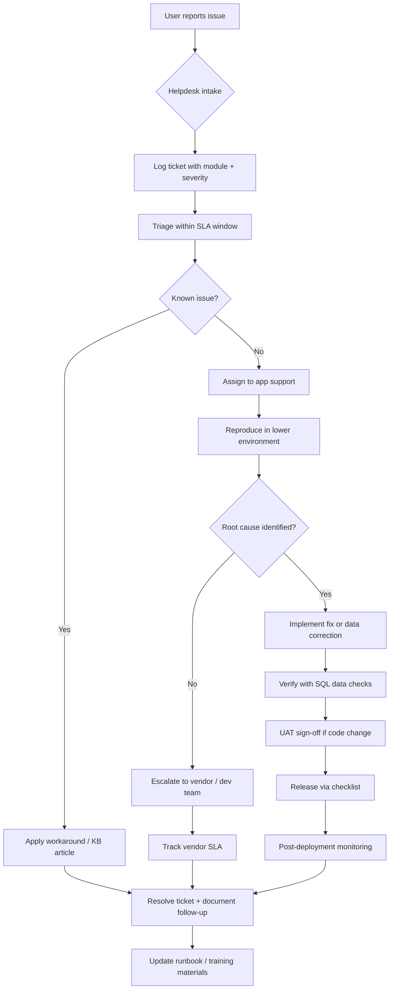

# Application Support Runbook Lab

A documentation-first portfolio repository demonstrating **enterprise application support** practices: incident triage, SQL data quality checks, UAT planning, release management, user training, vendor escalation, and post-deployment monitoring.

Includes an optional **FastAPI issue tracker** with synthetic tickets illustrating severity, module, root cause, status, resolution, and follow-up fields.

> **Note:** All incidents, organizations, and user accounts in this repository are **synthetic**. No employer-confidential processes or production system details are included.

## Why this repo exists

Hiring managers evaluating support and operations roles look for evidence that you can:

- Triage incidents systematically under time pressure
- Write repeatable runbooks others can follow
- Design SQL checks that catch data issues before users do
- Coordinate UAT, releases, training, and vendor escalations
- Monitor systems after deployment and close the loop

This lab packages those skills into recruiter-readable documentation plus a small working demo app.

## Support workflow



## Synthetic incident example

The following walkthrough uses entirely fictional data.

| Field | Value |
|-------|-------|
| **Ticket** | INC-240601 |
| **Title** | Enrollment batch stuck in pending state |
| **Severity** | P2 — major feature degraded, workaround exists |
| **Module** | Enrollment |
| **Reported by** | helpdesk@demo-org.example |
| **Symptoms** | 12 enrollments remain `pending`; confirmation emails not sent |

### Timeline

| Time (UTC) | Action |
|------------|--------|
| 08:12 | Helpdesk logs ticket; assigns P2 per [Incident Triage Runbook](docs/incident-triage-runbook.md) |
| 08:25 | App support confirms queue consumer lag in staging metrics |
| 08:40 | Root cause: message queue consumer pod crash-loop after config deploy |
| 09:05 | Workaround: manual replay from dead-letter queue restores 10/12 records |
| 09:30 | Permanent fix: rollback config, restart consumer, replay remaining messages |
| 10:00 | SQL checks confirm zero pending records older than 1 hour ([SQL checks doc](docs/sql-data-quality-checks.md)) |
| 10:15 | Ticket resolved; follow-up: add queue depth alert ([monitoring doc](docs/post-deployment-monitoring.md)) |

### Resolution summary

- **Root cause:** Downstream message queue consumer lag after bad configuration deploy
- **Resolution:** Restarted consumer; replayed dead-letter queue
- **Follow-up:** Monitor queue depth 72 hours; alert threshold at depth > 100

Try the demo ticket in the API: `GET /api/tickets` after starting the app (see below).

## Documentation index

| Document | Purpose |
|----------|---------|
| [Incident Triage Runbook](docs/incident-triage-runbook.md) | Severity matrix, SLA targets, triage checklist |
| [SQL Data Quality Checks](docs/sql-data-quality-checks.md) | Reusable queries for enrollment, auth, reporting |
| [UAT Test Plan](docs/uat-test-plan.md) | Template for user acceptance testing |
| [Release Checklist](docs/release-checklist.md) | Pre/during/post deployment gates |
| [User Training Guide](docs/user-training-guide.md) | End-user onboarding outline |
| [Vendor Escalation Template](docs/vendor-escalation-template.md) | Structured vendor communication |
| [Post-Deployment Monitoring](docs/post-deployment-monitoring.md) | Metrics, alerts, hypercare period |

## Optional demo app

A lightweight FastAPI issue tracker models the fields support teams track daily.

```bash
python -m venv .venv
source .venv/bin/activate
pip install -r requirements.txt
uvicorn app.main:app --reload --port 8001
```

| Endpoint | Description |
|----------|-------------|
| `GET /api/health` | Health check |
| `GET /api/tickets` | List tickets (filter by status, severity, module) |
| `POST /api/tickets` | Create ticket |
| `PATCH /api/tickets/{id}` | Update root cause, resolution, follow-up, status |

Interactive docs: [http://127.0.0.1:8001/docs](http://127.0.0.1:8001/docs)

Three synthetic tickets are seeded on startup, including INC-240601 from the example above.

## Tests

```bash
pytest -v
```

## Portfolio tips

When presenting this repo to recruiters:

1. Walk through the mermaid workflow and tie each box to a doc
2. Open INC-240601 in the demo API and show root cause → resolution → follow-up
3. Highlight one SQL check query and explain when it runs
4. Show the release checklist gate you would not skip

## License

MIT — portfolio demonstration project.
