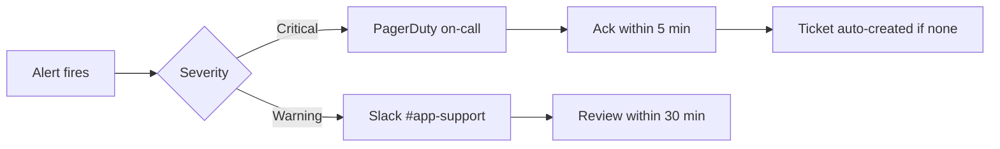

# Post-Deployment Monitoring

Guide for hypercare monitoring after production releases or incident resolution. Uses synthetic service names and thresholds.

## Hypercare period

| Release risk | Hypercare duration | Review cadence |
|--------------|-------------------|----------------|
| Low (config only) | 24 hours | Every 4 hours |
| Medium (app deploy) | 72 hours | Every 2 hours |
| High (DB migration, auth) | 5 business days | Continuous + daily summary |

## Monitoring dashboard tiles

### Application health

| Metric | Source | Warning | Critical |
|--------|--------|---------|----------|
| HTTP 5xx rate | APM / load balancer | > 0.5% | > 2% |
| p95 API latency | APM | > 800 ms | > 2000 ms |
| Health check failures | Synthetic probe | 1 failure | 3 consecutive |

### Enrollment pipeline

| Metric | Source | Warning | Critical |
|--------|--------|---------|----------|
| Queue depth | Message broker | > 100 | > 500 |
| Consumer lag (seconds) | Broker / app metrics | > 300 | > 900 |
| Pending enrollments > 1 hr | SQL check | > 0 | > 5 |
| Email delivery failure rate | Notification service | > 2% | > 10% |

### Authentication

| Metric | Source | Warning | Critical |
|--------|--------|---------|----------|
| Failed login rate | Auth logs | 3× baseline | 10× baseline |
| SSO callback errors | IdP integration logs | > 10 / 5 min | > 50 / 5 min |
| Active sessions growth | Session store | Unusual spike | Store at capacity |

### Reporting

| Metric | Source | Warning | Critical |
|--------|--------|---------|----------|
| Export job failure count | Job table / logs | > 3 / hour | > 10 / hour |
| Aggregate refresh age | SQL freshness check | > 26 hours | > 48 hours |

## Alert routing



## Daily hypercare report template

```
Release: {2024.06} — Day {2} of hypercare
Reporter: {name}

Metrics summary (vs baseline):
- 5xx rate: {0.1%} (baseline 0.08%) — OK
- Queue depth max: {45} (threshold 100) — OK
- Pending > 1 hr: {0} — OK
- Failed logins: {+12%} — OK

Tickets opened: {0 P1, 1 P3}
Tickets closed: {1}

Actions:
- {None / describe}

Go/no-go to exit hypercare: {GO / NO-GO}
```

## Exit hypercare criteria

- [ ] All critical alerts quiet for 24 consecutive hours
- [ ] SQL data quality suite passing ([sql-data-quality-checks.md](sql-data-quality-checks.md))
- [ ] No open P1/P2 tickets related to release
- [ ] Error and latency metrics within 10% of pre-release baseline
- [ ] Business owner informed of hypercare completion

## Follow-up from INC-240601 (synthetic)

After resolving the enrollment queue incident:

1. **Added alert:** queue depth > 100 for 5 minutes → Slack + PagerDuty
2. **Added dashboard panel:** consumer lag with 24-hour trend
3. **Scheduled check:** pending enrollment SQL every 15 minutes during business hours
4. **Runbook update:** DLQ replay steps added to [incident triage runbook](incident-triage-runbook.md)

## Tooling (examples)

| Function | Example tools |
|----------|---------------|
| Metrics | Prometheus, Datadog, CloudWatch |
| Logs | ELK, Splunk, Loki |
| Synthetic checks | Pingdom, Grafana k6 |
| Incident paging | PagerDuty, Opsgenie |

Names are illustrative; substitute your organization's stack.

## Related documents

- [Release Checklist](release-checklist.md)
- [Incident Triage Runbook](incident-triage-runbook.md)
- [SQL Data Quality Checks](sql-data-quality-checks.md)
